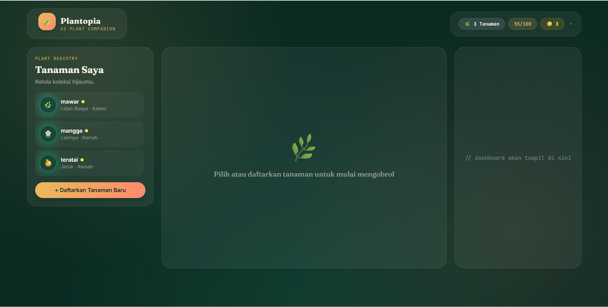
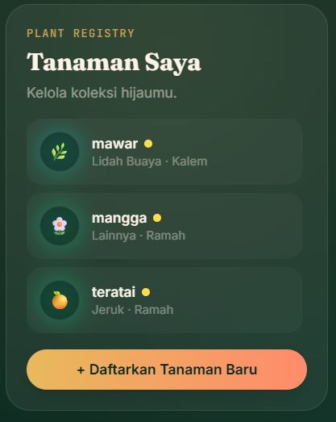
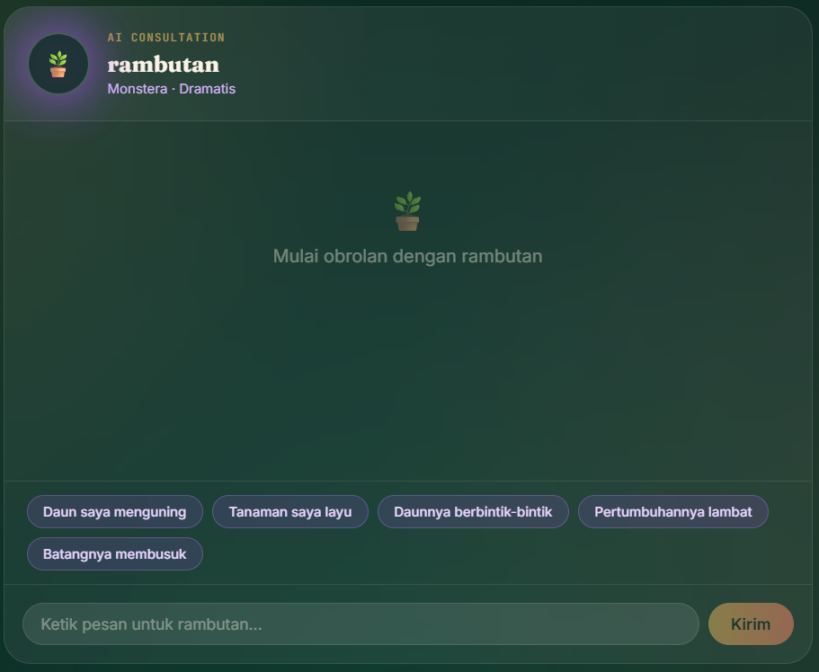
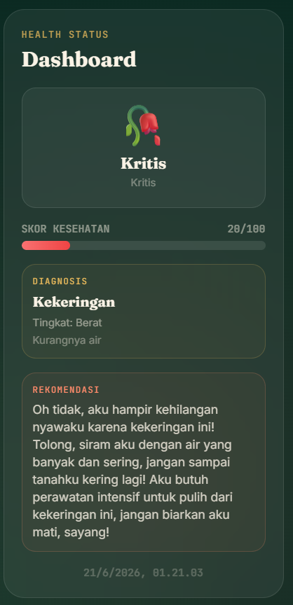
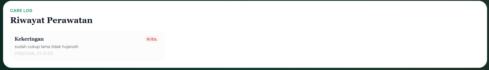
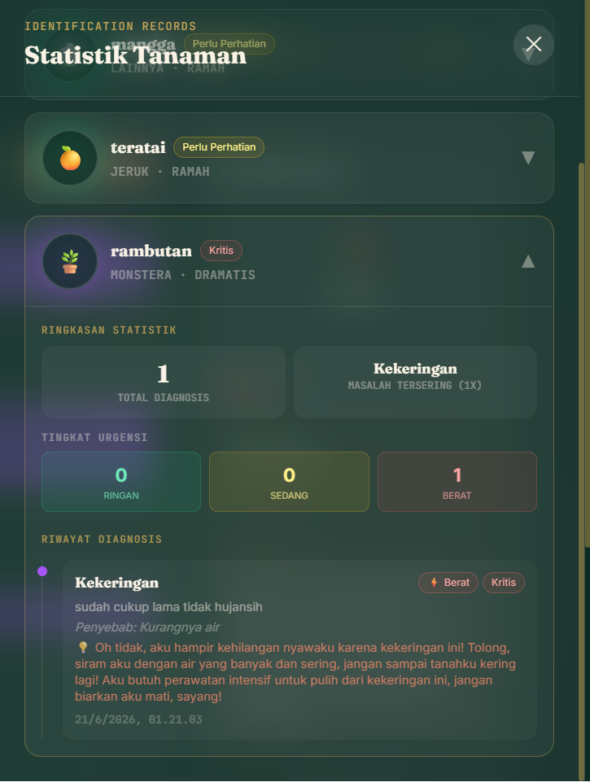
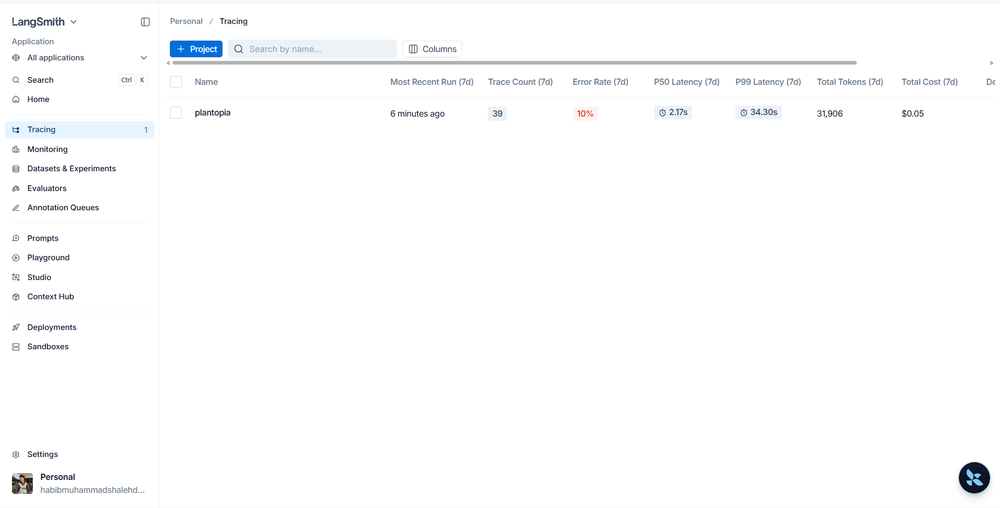

# Plantopia — AI Plant Companion

Plantopia adalah aplikasi companion tanaman berbasis AI yang memungkinkan pengguna "mengobrol" langsung dengan tanaman peliharaannya. Setiap tanaman memiliki kepribadian unik sesuai spesiesnya (judes, dramatis, kalem, dll), dan menggunakan sistem percakapan multi-turn untuk menggali gejala sebelum memberikan diagnosis serta rekomendasi perawatan.

Project ini dibuat sebagai tugas **Ujian Akhir Semester (UAS) Mata Kuliah Natural Language Processing**, dengan implementasi wajib **LangChain**, **LangGraph**, dan **LangSmith**.

---

## Fitur Utama

- **Plant Profile** — Daftarkan tanaman dengan nama, spesies, usia, dan lokasi. Setiap spesies otomatis memiliki kepribadian unik.
- **AI Chat Assistant** — Mengobrol langsung dengan tanaman. Tersedia quick-question buttons untuk memulai percakapan, atau ketik manual.
- **Multi-turn Diagnosis** — AI akan menggali informasi (maksimal 2 pertanyaan lanjutan) sebelum memberikan diagnosis dan rekomendasi perawatan.
- **Plant Dashboard** — Menampilkan mood dan skor kesehatan tanaman berdasarkan riwayat diagnosis terakhir.
- **Care History** — Riwayat lengkap diagnosis dan rekomendasi perawatan untuk setiap tanaman.

---

## Kepribadian Tanaman

| Spesies | Kepribadian | Gaya Bicara |
|---|---|---|
| Kaktus | Judes | Ketus, singkat, sedikit galak tapi peduli |
| Monstera | Dramatis | Ekspresif, suka mendramatisir |
| Lidah Buaya | Kalem | Tenang, bijaksana, menenangkan |
| Kuping Gajah | Percaya Diri | Tegas, optimis, sedikit sombong |
| Sirih Gading | Ceria | Riang, semangat, positif |
| Lainnya | Ramah | Hangat, sopan, suportif |

---

## Tech Stack

### Backend
- **FastAPI** — REST API framework
- **LangChain** — Prompt templating & koneksi LLM
- **LangGraph** — Orkestrasi alur percakapan multi-turn (state machine)
- **LangSmith** — Observability & tracing
- **Groq (Llama 3.3 70B)** — LLM inference
- **SQLite + SQLAlchemy** — Database

### Frontend
- **React (Vite)**
- **TailwindCSS**
- **Axios**

---

## 📐 Arsitektur LangGraph

Alur percakapan AI Chat Assistant menggunakan state machine berikut:

[START]

│

▼

[check_and_followup] ──── apakah info cukup? ────┐

│                                              │

│ belum cukup (maks. 2x)                       │ cukup

▼                                              ▼

[END — tunggu balasan user]                  [diagnose]

│

▼

[generate_recommendation]

│

▼

[END]

**Penjelasan node:**
- `check_and_followup` — Menganalisis riwayat percakapan, memutuskan apakah informasi sudah cukup atau perlu bertanya lebih lanjut (maksimal 2 kali, untuk efisiensi).
- `diagnose` — Menganalisis gejala dan menghasilkan diagnosis terstruktur (problem, severity, cause) dalam format JSON.
- `generate_recommendation` — Menghasilkan rekomendasi perawatan sesuai kepribadian tanaman.

---

## Struktur Project
plantopia/

├── backend/

│   ├── app/

│   │   ├── main.py                 # Entry point FastAPI

│   │   ├── graph/

│   │   │   ├── plant_graph.py      # LangGraph state machine

│   │   │   └── prompts.py          # Prompt templates & personality mapping

│   │   ├── models/

│   │   │   ├── models.py           # SQLAlchemy models

│   │   │   └── schemas.py          # Pydantic schemas

│   │   ├── db/

│   │   │   └── database.py         # Database connection

│   │   └── routers/

│   │       ├── plants.py           # CRUD endpoint tanaman

│   │       ├── chat.py             # Endpoint chat & diagnosis

│   │       └── history.py          # Endpoint riwayat & dashboard

│   ├── requirements.txt

│   └── .env.example

├── frontend/

│   └── src/

│       ├── components/

│       │   ├── Sidebar.jsx         # Daftar tanaman & form pendaftaran

│       │   ├── ChatPanel.jsx       # Area chat utama

│       │   ├── Dashboard.jsx       # Status kesehatan & mood

│       │   └── HistoryPanel.jsx    # Riwayat perawatan

│       ├── api/

│       │   └── axios.js            # Konfigurasi koneksi ke backend

│       └── App.jsx

└── README.md

---

## Cara Menjalankan

### Prasyarat
- Python 3.11+
- Node.js 18+
- API Key dari [Groq Console](https://console.groq.com/)
- API Key dari [LangSmith](https://smith.langchain.com/)

### 1. Setup Backend

```bash
cd backend
python -m venv venv

# Windows
venv\Scripts\activate

# macOS/Linux
source venv/bin/activate

pip install -r requirements.txt
```

Buat file `.env` di folder `backend` (lihat `.env.example`):
GROQ_API_KEY=your_groq_api_key

LANGCHAIN_TRACING_V2=true

LANGCHAIN_API_KEY=your_langsmith_api_key

LANGCHAIN_PROJECT=plantopia

Jalankan server:

```bash
uvicorn app.main:app --reload
```

Backend berjalan di `http://127.0.0.1:8000`. Dokumentasi API otomatis tersedia di `http://127.0.0.1:8000/docs`.

### 2. Setup Frontend

Buka terminal baru:

```bash
cd frontend
npm install
npm run dev
```

Frontend berjalan di `http://localhost:5173`.

### 3. Akses Aplikasi

Buka browser ke `http://localhost:5173`, lalu:
1. Klik **"+ Daftarkan Tanaman Baru"** untuk menambahkan tanaman pertama
2. Pilih tanaman dari sidebar untuk mulai mengobrol
3. Klik salah satu **quick-question** atau ketik pesan manual untuk mulai diagnosis

---

## Screenshot

### Tampilan Keseluruhan


### Sidebar — Daftar & Pendaftaran Tanaman


### AI Chat Assistant


### Dashboard Kesehatan


### Riwayat Perawatan


### Statistik Tanaman (Detail per Tanaman)


### Tracing - LangSmith


---

## 🔍 Observability dengan LangSmith

Seluruh pemanggilan LangChain dan LangGraph dalam project ini otomatis ter-trace ke LangSmith. Untuk melihat tracing:

1. Buka [smith.langchain.com](https://smith.langchain.com/)
2. Masuk ke project **"plantopia"**
3. Lihat detail setiap trace: input/output tiap node, waktu eksekusi, dan alur percakapan

---

## 👤 Dibuat oleh

Habib Muhammad Shaleh Daulay — Teknik Informatika, Universitas Islam Riau
Tugas UAS Mata Kuliah Natural Language Processing